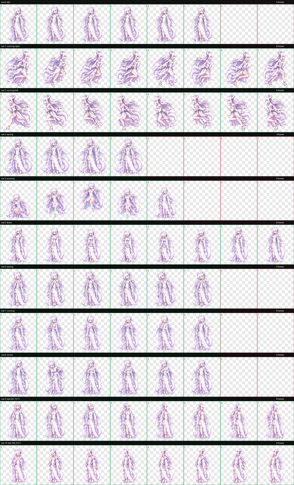

# GPT Dragon Girl Pet / GPT 龙娘桌宠

An animated, mature-style GPT dragon girl companion for ChatGPT Work and Codex Pets.

为 ChatGPT Work 与 Codex Pets 制作的御姐风 GPT 龙娘动态桌宠：银白长发、浅紫龙翼、龙角与鳞尾，包含完整基础动作和 16 方向注视动画。


## Features / 特性

- ChatGPT Pet v2 sprite sheet: 1536 × 2288 pixels
- 8 columns × 11 rows; each cell is 192 × 208 pixels
- 9 standard animation states and 16 look directions
- Transparent WebP artwork with chroma-spill cleanup
- Independent pet ID: `gpt-dragon-lady`
- Does not overwrite the DeepSeek pet

- ChatGPT Pet v2 精灵图：1536 × 2288 像素
- 8 列 × 11 行，单格 192 × 208 像素
- 9 组基础动作与 16 个注视方向
- 透明 WebP 图像，已完成绿幕边缘清理
- 独立宠物 ID：`gpt-dragon-lady`
- 不会覆盖已有的 DeepSeek 桌宠

## Download / 下载

Download **`GPT龙娘.zip`** from the repository file list. Do not use GitHub's automatically generated “Source code” archive as the pet package.

请从仓库文件列表下载 **`GPT龙娘.zip`**。不要把 GitHub 自动生成的 “Source code” 压缩包当成桌宠安装包。

## Windows installation / Windows 安装教程

1. Download `GPT龙娘.zip`.
2. Extract it. You should get a folder named `GPT龙娘`.
3. Press `Win + R`, enter `%USERPROFILE%\.codex\pets`, and press Enter.
4. Copy the extracted `GPT龙娘` folder into that `pets` directory.
5. Restart or refresh Codex.
6. Open the Pets selector and choose **GPT龙娘**.

1. 下载 `GPT龙娘.zip`。
2. 解压后应得到名为 `GPT龙娘` 的文件夹。
3. 按 `Win + R`，输入 `%USERPROFILE%\.codex\pets`，然后回车。
4. 将解压得到的 `GPT龙娘` 文件夹复制到该 `pets` 目录。
5. 重启或刷新 Codex。
6. 打开桌宠选择器，选择 **GPT龙娘**。

Expected directory layout / 正确目录结构：

```text
%USERPROFILE%\.codex\pets\
├─ deepseek\                 # Existing DeepSeek pet remains untouched
└─ GPT龙娘\
   ├─ pet.json
   └─ spritesheet.webp
```

If the pet does not appear, check that there is not an extra nested folder such as `GPT龙娘\GPT龙娘\pet.json`.

如果桌宠没有出现，请确认没有多套一层目录，例如错误的 `GPT龙娘\GPT龙娘\pet.json`。

## macOS installation / macOS 安装教程

1. Download and extract `GPT龙娘.zip`.
2. In Finder, press `Command + Shift + G` and enter `~/.codex/pets`.
3. Copy the extracted `GPT龙娘` folder into the `pets` directory.
4. Restart or refresh the ChatGPT desktop app or Codex.
5. Open **Settings > Pets**, select **GPT龙娘**, then enter `/pet` if you want to show the floating pet.

1. 下载并解压 `GPT龙娘.zip`。
2. 在 Finder 中按 `Command + Shift + G`，输入 `~/.codex/pets`。
3. 将解压得到的 `GPT龙娘` 文件夹复制到 `pets` 目录。
4. 重启或刷新 ChatGPT 桌面应用或 Codex。
5. 打开 **Settings > Pets**，选择 **GPT龙娘**；如需显示悬浮桌宠，可输入 `/pet`。

You can also install it from Terminal / 也可以通过终端安装：

```bash
mkdir -p ~/.codex/pets
cp -R ~/Downloads/GPT龙娘 ~/.codex/pets/
```

Expected directory layout / 正确目录结构：

```text
~/.codex/pets/
├─ deepseek/                 # Existing DeepSeek pet remains untouched
└─ GPT龙娘/
   ├─ pet.json
   └─ spritesheet.webp
```

For terminal pets on macOS, use iTerm2 3.6 or later, or another terminal with Kitty graphics or Sixel support. Terminal pets are unavailable inside tmux and Zellij.

在 macOS 终端中使用桌宠时，请使用 iTerm2 3.6 或更高版本，或支持 Kitty 图形协议/Sixel 的终端；tmux 与 Zellij 内暂不支持终端桌宠。

## ChatGPT Work / ChatGPT Work

If your ChatGPT Work workspace supports custom Pets, use the `spritesheet.webp` contained in `GPT龙娘.zip` as the custom pet sprite sheet. The atlas uses the supported v2 layout.

如果你的 ChatGPT Work 工作区支持自定义 Pets，可使用 `GPT龙娘.zip` 内的 `spritesheet.webp` 作为自定义宠物精灵图；该图集符合 v2 布局。

Custom desktop pets are stored locally and do not automatically sync to ChatGPT web. Pet availability can also depend on your account and workspace settings.

桌面端自定义宠物保存在本机，不会自动同步到 ChatGPT 网页版；Pets 是否可用也可能取决于账号与工作区设置。

## Verify the download / 校验下载

The expected SHA-256 values are stored in `SHA256SUMS.txt`.

PowerShell / PowerShell 校验命令：

```powershell
Get-FileHash -Algorithm SHA256 .\GPT龙娘.zip
```

Expected package hash / 安装包应有哈希：

```text
3805B45279453E9B8989FC32AC74BEFC5D14DDA96D748C0F4039CE3273B14C7F
```

## Uninstall / 卸载

Close Codex or the ChatGPT desktop app, remove only `%USERPROFILE%\.codex\pets\GPT龙娘` on Windows or `~/.codex/pets/GPT龙娘` on macOS, and restart the app. Do not remove the `deepseek` folder if you want to keep the DeepSeek pet.

关闭 Codex 或 ChatGPT 桌面应用；Windows 仅删除 `%USERPROFILE%\.codex\pets\GPT龙娘`，macOS 仅删除 `~/.codex/pets/GPT龙娘`，再重新启动应用。若要保留 DeepSeek 桌宠，请不要删除 `deepseek` 文件夹。

## Repository files / 仓库文件

- `GPT龙娘.zip` — ready-to-install package / 可直接安装的压缩包
- `README.md` — bilingual guide / 中英双语说明
- `SHA256SUMS.txt` — checksums / 校验值
- `final-contact-sheet.png` — full animation overview / 全动作总览
- `idle.gif` — idle animation preview / 待机动画预览


